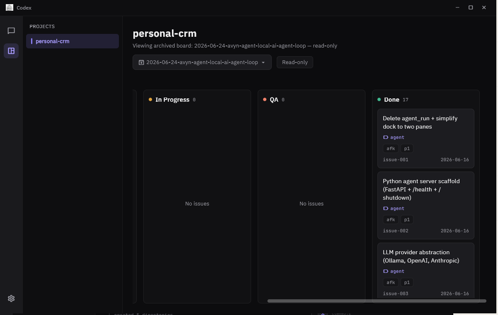
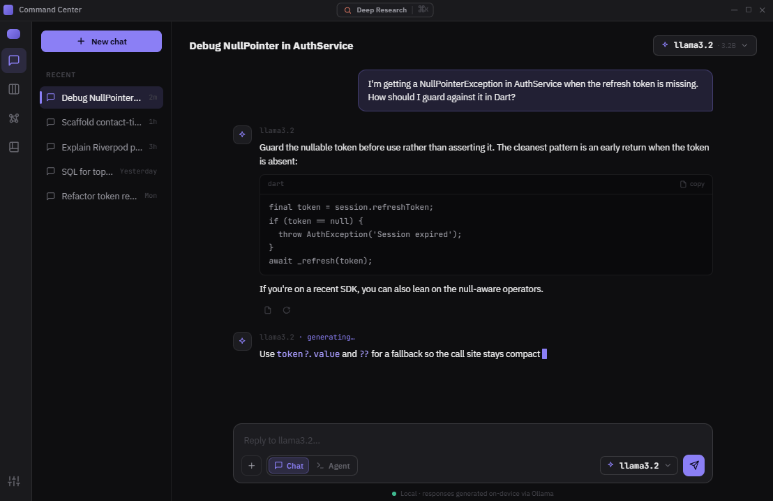

<div align="center">


# Avyn

A personal desktop app combining project/issue tracking (kanban) with a local AI agent — persistent memory, tool access, and a self-hosted agent server.

[](https://flutter.dev)
[](https://dart.dev)
[](https://python.org)
[]()

</div>

---

<div align="center">



</div>

---

> Desktop-first today. See [ROADMAP.md](ROADMAP.md) for where this is headed.

---

## Features

- **Kanban board** — markdown-file issues with YAML frontmatter, inline raw-markdown editor, and an archive of completed cycles.
- **Unified dock** — real terminal and agent chat open *alongside* the board in one resizable dock.
- **Home chat** — full-screen agent chat with model picker and session sidebar.
- **Local agent server** — persistent memory, file/shell sandbox, deep research, tool calls rendered inline.
- **Multi-provider LLM** — Anthropic, OpenAI, Ollama, and more, each configurable in Settings.

---

## Prerequisites

| Tool | Version |
|---|---|
| Flutter SDK | 3.35+ |
| Python | 3.11+ |
| Docker | latest (optional — SearXNG deep research) |
| Ollama | latest (optional — local LLM) |

---

## Getting Started

```bash
flutter pub get
cd agent && pip install -r requirements.txt
flutter run -d windows
```

The Flutter app spawns the agent server automatically on launch.

---

## Project Structure

```
lib/
├── core/           # DI, state, theme, cache, shared widgets
└── features/
    ├── shell/      # App shell — rail, sidebar
    ├── kanban/     # Board, issue editor, docked terminal/chat
    ├── home/       # Full-screen agent chat
    ├── agent/      # Agent server lifecycle
    ├── brain/      # Persistent-memory file management
    └── settings/   # Projects, LLM providers, brain

agent/
├── main.py         # FastAPI — /chat, /sessions, /health, /shutdown
├── providers/      # Anthropic / OpenAI / Ollama
├── tools/          # filesystem, shell, memory, web, research
├── brain.py        # identity/soul/memory → system prompt
├── db.py           # SQLite — session history
└── vector.py       # ChromaDB — vector memory
```
